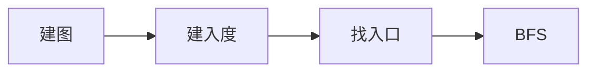

# Togological Sort Kahn

:::tip 概念

排序任务优先级，任务需要有次序，所以需要有向

任务不能循环执行，所以需要无环（也就可以判断图是否有环）

**有向无环图(DAG)**

:::

## Kahn 算法

> 贪心算法，不断寻找每个入度为 0 的节点



```js
/**
 * 拓扑排序算法生成的是有向无环图的拓扑排序
 * 1. 有向
 * 2. 无环
 *
 *  V：顶点数量
 *  edges: Array<Array<T>>
 */

function topoSortbyKahn(V, edges) {
    const graph = {}
    const inDegrees = {}

    /**
     *  1. 建图 graph
     *  2. 建入度 inDegrees
     */
    for (const edge of edges) {
        const [start, end] = [edge[0], edge[1]]

        const item = graph[start]

        item ? item.push(end) : (graph[start] = [end])

        !inDegrees[start] && (inDegrees[start] = 0)
        !inDegrees[end] && (inDegrees[end] = 0)

        inDegrees[end] += 1
    }

    console.log(graph)
    /**
     *  3. 找入口
     */
    const queue = []
    const inDegreeIter = Object.entries(inDegrees)

    for (const [edge, degree] of inDegreeIter) {
        degree === 0 && queue.push(edge)
    }

    /**
     *  4. BFS
     */
    let count = 0
    while (queue.length > 0) {
        const curr = queue.shift()
        count += 1

        console.log('topo sort result', curr)
        const neis = graph[curr] ?? []

        for (const edge of neis) {
            if (--inDegrees[edge] === 0) {
                queue.push(edge)
            }
        }
    }

    console.log('is finish', count === V)
}

const V = 6
const edges = [
    ['A', 'C'],
    ['A', 'D'],
    ['C', 'F'],
    ['F', 'E'],
    ['B', 'D'],
    ['B', 'E'],
]

topoSortbyKahn(V, edges)
```